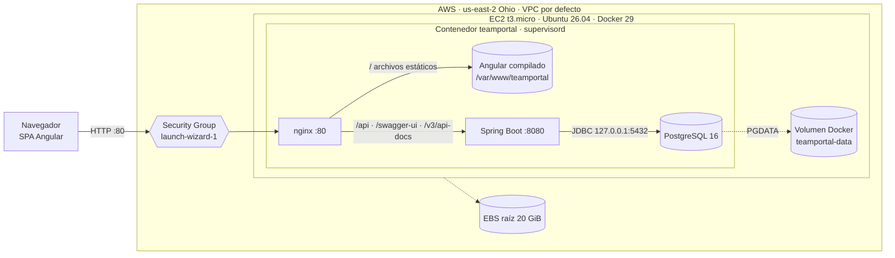
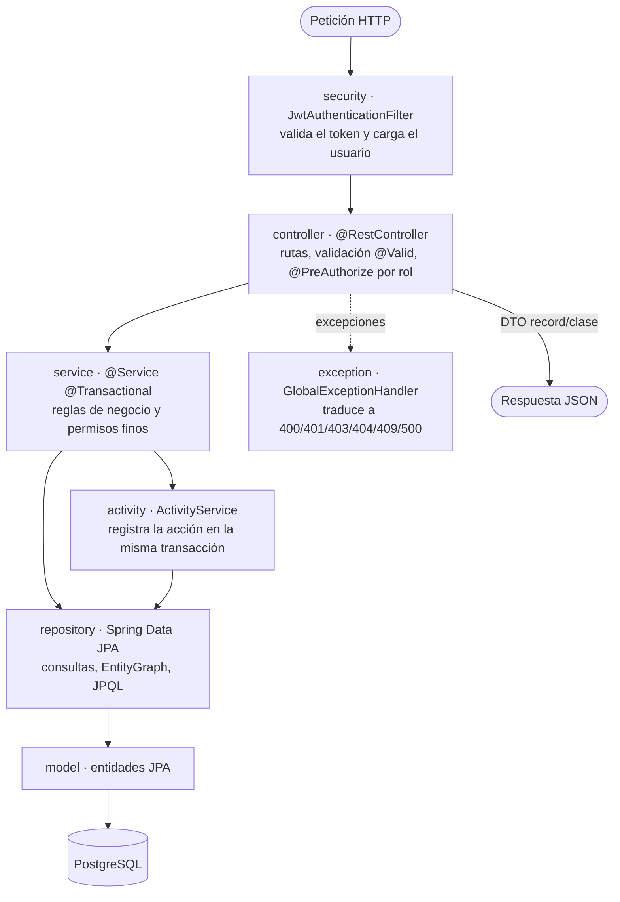
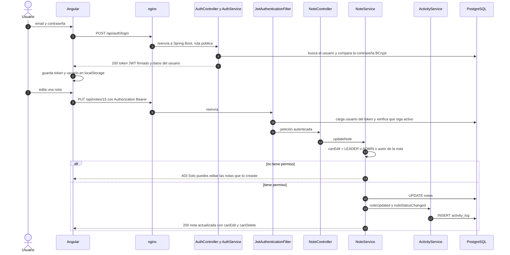
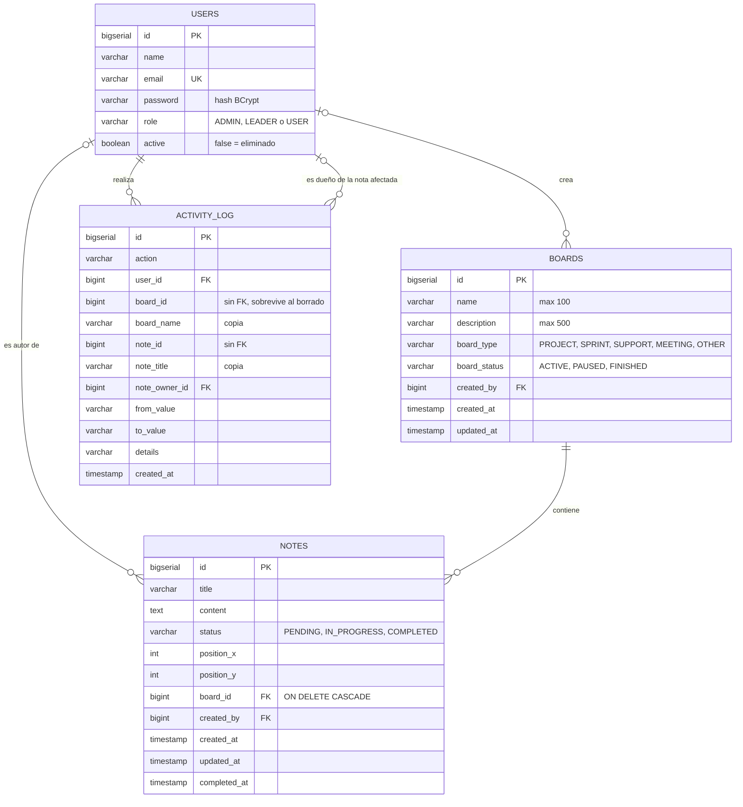
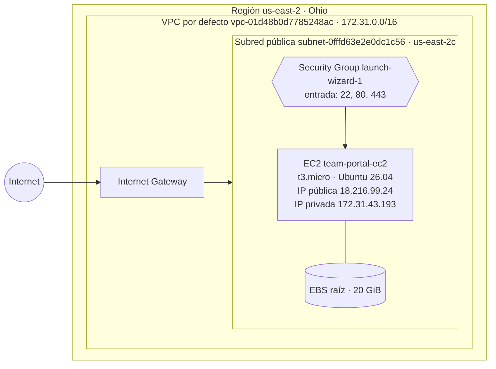
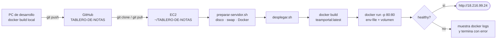
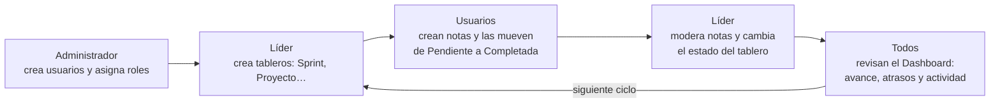

# TABLERO-DE-NOTAS · Team Portal

Portal de equipo con tableros de notas tipo *post-it*, control de acceso por roles (Administrador, Líder y Usuario), un dashboard de métricas y un historial de actividad. El backend es una API REST en **Spring Boot 4 (Java 21)** sobre **PostgreSQL 16**. El frontend es una SPA en **Angular 21**. Todo se empaqueta en **una sola imagen Docker** y está desplegado en **AWS EC2**.

| Recurso | Dirección |
|---|---|
| **Aplicación en producción** | http://18.216.99.24 |
| **Documentación interactiva de la API (Swagger UI)** | http://18.216.99.24/swagger-ui/index.html |
| **Especificación OpenAPI** | http://18.216.99.24/v3/api-docs (JSON) · http://18.216.99.24/v3/api-docs.yaml (YAML) |
| **Repositorio** | https://github.com/karlajdelgado26-star/TABLERO-DE-NOTAS |

> La IP pública de la instancia cambia si se detiene y se vuelve a iniciar la instancia EC2. Ver [9.3 Recursos en AWS](#93-recursos-en-aws).

---

## Contenido

1. [Descripción funcional](#1-descripción-funcional)
2. [Cómo acceder a la documentación del proyecto](#2-cómo-acceder-a-la-documentación-del-proyecto)
3. [Arquitectura](#3-arquitectura)
4. [Patrones de diseño](#4-patrones-de-diseño)
5. [Tecnologías y versiones](#5-tecnologías-y-versiones)
6. [Estructura del código](#6-estructura-del-código)
7. [Seguridad, roles y reglas de negocio](#7-seguridad-roles-y-reglas-de-negocio)
8. [API REST: endpoints](#8-api-rest-endpoints)
9. [Infraestructura y despliegue](#9-infraestructura-y-despliegue)
10. [Incidencias del despliegue y cómo se resolvieron](#10-incidencias-del-despliegue-y-cómo-se-resolvieron)
11. [Manual de uso](#11-manual-de-uso)
12. [Operación y mantenimiento](#12-operación-y-mantenimiento)

---

## 1. Descripción funcional

- **Tableros.** Agrupan notas. Cada tablero tiene un **tipo** (Proyecto, Sprint, Soporte, Reunión, Otro) y un **estado** (Activo, En pausa, Finalizado).
- **Notas.** Tarjetas con título, contenido y **estado** (Pendiente, En progreso, Completada). Se arrastran libremente sobre el lienzo del tablero y guardan su posición.
- **Roles.** Cada usuario tiene un rol:
  - **Usuario:** crea notas y solo modifica las suyas.
  - **Líder:** además administra tableros y modera cualquier nota.
  - **Administrador:** además gestiona usuarios.
- **Dashboard.** Muestra a los tres roles las mismas métricas:
  - avance general, notas por estado y tableros por tipo y estado;
  - avance en el tiempo y notas por empleado y por tablero;
  - quién tiene más y menos notas, el historial de actividad y el detalle de notas.
- **Historial de actividad.** Registra quién creó, editó, movió, cambió de estado o eliminó cada nota o tablero, y cuándo.
- **Eliminación de usuarios sin pérdida de datos.** "Eliminar" un usuario lo **desactiva**: ya no puede entrar, pero sus notas se conservan con su nombre.

---

## 2. Cómo acceder a la documentación del proyecto

| Documentación | Dónde | Para qué |
|---|---|---|
| **Este README** | Raíz del repositorio (se ve en la portada de GitHub) | Arquitectura, código, infraestructura, despliegue y manual de uso |
| **Swagger UI** | `http://<servidor>/swagger-ui/index.html` | Ver todos los endpoints agrupados por módulo, sus parámetros, cuerpos y respuestas, y **probarlos** desde el navegador |
| **OpenAPI 3 (JSON/YAML)** | `http://<servidor>/v3/api-docs` y `/v3/api-docs.yaml` | Importar la API en Postman, Insomnia o un generador de clientes |
| **Capturas del manual** | [`docs/manual/`](docs/manual) | Imágenes usadas en el [manual de uso](#11-manual-de-uso) |
| **Scripts de despliegue** | [`deploy/ec2/`](deploy/ec2) | Cada script explica en su encabezado qué hace y cómo se usa |
| **Migraciones de base de datos** | [`backend/src/main/resources/db/migration/`](backend/src/main/resources/db/migration) | Historia versionada del esquema (Flyway) |
| **Comentarios en el código** | Servicios, controladores y DTO del backend | Javadoc con las reglas de negocio de cada operación |

`<servidor>` es `18.216.99.24` en AWS o `localhost:8081` si se ejecuta con Docker en un PC (ver [9.2](#92-ejecutar-en-un-pc-con-docker)).

### 2.1 Probar la API con Swagger UI

1. Abre `http://<servidor>/swagger-ui/index.html`. Los endpoints aparecen agrupados: *1. Autenticación*, *2. Tableros*, *3. Notas*, *4. Usuarios*, *5. Dashboard* y *6. Actividad*.
2. Despliega **1. Autenticación → POST /api/auth/login** y pulsa **Try it out**.
3. Escribe un email y una contraseña válidos en el cuerpo y pulsa **Execute**.
4. Copia el valor de `token` de la respuesta.
5. Pulsa **Authorize** (arriba a la derecha), pega el token **sin** la palabra `Bearer` y confirma.
6. Ya puedes ejecutar cualquier endpoint. El resultado depende del rol del usuario con el que iniciaste sesión. Por ejemplo, un `USER` recibe `403` en `/api/users`.

El token queda guardado en esa pestaña del navegador (`persist-authorization`) y vence a las 24 horas.

### 2.2 Importar la API en Postman

*Import → Link* → `http://<servidor>/v3/api-docs`. Postman crea una colección con todos los endpoints. En la pestaña *Authorization* de la colección elige *Bearer Token* y pega el token del login.

### 2.3 Ocultar la documentación en un entorno productivo

Swagger UI y `/v3/api-docs` son públicos. Solo describen la API; para usarla sigue siendo necesario un token.

Para desactivarlos:

1. Agrega `API_DOCS_ENABLED=false` en `/opt/teamportal/teamportal.env`.
2. Reinicia con `sudo bash deploy/ec2/desplegar.sh --sin-actualizar --sin-compilar`.

---

## 3. Arquitectura

### 3.1 Vista general



**Cómo viaja una petición:**

- El navegador solo habla con **nginx**, en el puerto 80.
- nginx entrega el frontend compilado y reenvía `/api/*` (y la documentación) a Spring Boot, que escucha solo dentro del contenedor.
- Spring Boot usa PostgreSQL, que también está dentro del contenedor y guarda sus datos en un volumen Docker.
- Ni el backend (8080) ni la base de datos (5432) quedan expuestos a internet.
- Frontend y API comparten el mismo origen, así que no hace falta configurar CORS.

### 3.2 Patrón de arquitectura

| Nivel | Patrón | Cómo se aplica |
|---|---|---|
| Sistema | **Cliente-servidor en tres capas** (presentación, lógica, datos) | SPA Angular → API REST Spring Boot → PostgreSQL |
| Backend | **Arquitectura en capas** (*Layered Architecture*) | `controller` → `service` → `repository` → `model` (entidades JPA). Cada capa solo llama a la de abajo |
| Backend | **Monolito modular**, organizado **por funcionalidad** (*package by feature*) | Un paquete por dominio: `auth`, `user`, `board`, `note`, `activity`, `dashboard`. Cada uno con sus capas internas. Los transversales van aparte: `security`, `config`, `exception` |
| API | **REST sin estado** (*stateless*) con **JWT** | El servidor no guarda sesión. Cada petición trae `Authorization: Bearer <token>` |
| Frontend | **SPA por features** (`core` / `features` / `shared`) | Componentes *standalone*, estado reactivo con *signals*, rutas protegidas con *guards* y carga diferida del dashboard |
| Despliegue | **Reverse proxy** + **contenedor único** (*all-in-one*) | nginx como puerta de entrada. supervisord mantiene vivos nginx, Spring Boot y PostgreSQL en una misma imagen |
| Datos | **Migraciones versionadas** (*evolutionary database design*) | Flyway aplica `V1`, `V2`, `V3` al arrancar. Hibernate solo **valida** el esquema (`ddl-auto: validate`) |

**Capas del backend y responsabilidades:**



- **Controladores:** no contienen lógica. Reciben DTO, delegan al servicio y devuelven DTO. Nunca exponen entidades.
- **Servicios:** concentran las reglas, por ejemplo "un USER solo edita sus notas" o "siempre debe quedar un administrador activo". Son transaccionales.
- **Registro de actividad:** `ActivityService` se llama **dentro de la misma transacción**. Si la operación falla, no queda rastro en el historial.
- **Errores:** `GlobalExceptionHandler` convierte las excepciones de dominio (`ResourceNotFoundException`, `ForbiddenOperationException`, `BusinessRuleException`) en respuestas HTTP uniformes.

### 3.3 Flujo de autenticación y de una operación protegida



Si el token vence o el administrador desactiva al usuario, el filtro no autentica la petición y la API responde `401`. El interceptor de Angular cierra la sesión y lleva al login. Un `403` no cierra la sesión: solo se muestra el mensaje.

---

## 4. Patrones de diseño

| Patrón | Dónde está | Para qué se usa |
|---|---|---|
| **DTO (Data Transfer Object)** | `*/dto/*` (`BoardRequest`, `NoteResponse`, `DashboardResponse`…), muchos como `record` | Separar el contrato de la API de las entidades JPA. Nunca se serializa una entidad |
| **Repository** | `*/repository/*` (Spring Data `JpaRepository`) | Aislar el acceso a datos. `@EntityGraph` y `join fetch` evitan consultas N+1 |
| **Service Layer** | `*/service/*` | Centralizar reglas de negocio y límites transaccionales (`@Transactional`) |
| **Inyección de dependencias** (por constructor) | Todos los `@Service`, `@RestController`, `@Component` | Bajo acoplamiento y clases fáciles de probar. Campos `final` |
| **Front Controller** | `DispatcherServlet` de Spring MVC | Un único punto de entrada que enruta a los controladores |
| **Chain of Responsibility** | Cadena de filtros de Spring Security + `JwtAuthenticationFilter`. `authInterceptor` en Angular | Cada eslabón procesa la petición (autenticar, añadir token, cerrar sesión en 401) y la pasa al siguiente |
| **Template Method** | `JwtAuthenticationFilter extends OncePerRequestFilter` (`doFilterInternal`) | Spring define el esqueleto del filtro y la clase completa el paso específico |
| **Adapter** | `AuthenticatedUser implements UserDetails` | Adaptar la entidad `User` al contrato que espera Spring Security |
| **Static Factory Method** | `BoardResponse.from(...)`, `UserSummary.from(...)`, `ActivityResponse.from(...)`, `PageResponse.of(...)`, `AuthenticatedUser.from(...)` | Construir DTO desde entidades con un nombre expresivo y en un solo lugar |
| **Builder** | `Jwts.builder()` en `JwtUtil`, `HttpParams` en Angular | Construir objetos complejos paso a paso |
| **Query Object** | Clase interna `Where` en `ActivityService` | Armar el `WHERE` de JPQL solo con los filtros presentes, con parámetros enlazados (sin concatenar valores) |
| **Centralized Exception Handling** (*Controller Advice*) | `GlobalExceptionHandler` (`@RestControllerAdvice`) | Formato de error único `{timestamp, status, error, message, path}` |
| **Audit Trail / Audit Log** | `ActivityLog` + `ActivityService` | Historial inmutable de acciones. Copia el nombre del tablero y el título de la nota para que se lea aunque se eliminen |
| **Soft Delete** | `users.active` + `UserService.deactivateUser` | "Eliminar" usuario sin romper la integridad referencial ni perder la autoría de las notas |
| **Information Expert** (GRASP) | `Role.canManageBoards()`, `Role.canModerateNotes()`, `Note.changeStatus()`, `Note.isOwnedBy()` | La regla vive en el objeto que tiene la información. `changeStatus` mantiene `completedAt` coherente |
| **Guard** | `authGuard`, `roleGuard(['ADMIN'])` en Angular | Impedir la navegación a rutas sin sesión o sin el rol requerido |
| **Observer / reactivo** | *Signals* y RxJS (`Observable`) en Angular | La interfaz se actualiza sola cuando cambian los datos o el usuario |
| **Facade** | `AuthService` (Angular) | Oculta `HttpClient`, `localStorage` y `Router` detrás de `login()`, `logout()` y `canManageBoards()` |
| **Container / Presentational** | `DashboardComponent` (contenedor) y `donut-chart`, `stacked-bars`, `line-chart`, `bar-list` (presentación) | Las gráficas solo reciben datos por `input()` y emiten eventos por `output()`. No llaman a la API |
| **Lazy Loading** | Ruta `/dashboard` con `loadComponent` | El código del dashboard solo se descarga cuando se abre |

**Principios aplicados:**

- **Responsabilidad única** por clase.
- **Configuración por variables de entorno**, siguiendo *12-factor*: ningún secreto va en el código.
- **Validación declarativa** con Bean Validation (`@NotBlank`, `@Size`, `@Email`).
- **Mínimo privilegio:** la seguridad se valida en dos niveles. La URL o el método se protegen con `@PreAuthorize` y la propiedad del recurso se comprueba en el servicio.

---

## 5. Tecnologías y versiones

| Capa | Tecnología | Versión |
|---|---|---|
| Frontend | Angular (standalone, signals, control flow `@if/@for`) | 21.1 |
| Frontend | Angular CDK (arrastrar y soltar notas) | 21.1 |
| Frontend | TypeScript · RxJS · Vitest | 5.9 · 7.8 · 4 |
| Backend | Java | 21 |
| Backend | Spring Boot (Web MVC, Data JPA, Security 7, Validation) | 4.1.1 |
| Backend | Hibernate ORM | 7 (incluido en Spring Boot) |
| Backend | Flyway (migraciones) | incluido en Spring Boot |
| Backend | jjwt (JSON Web Tokens) | 0.12.3 |
| Backend | springdoc-openapi (Swagger UI + OpenAPI 3) | 3.1.1 |
| Base de datos | PostgreSQL | 16 |
| Servidor web | nginx | 1.24 |
| Procesos | supervisord | 4 |
| Contenedor | Docker Engine · BuildKit (buildx) | 29.1 · 0.30 |
| Imágenes base | `node:22-bookworm-slim`, `maven:3.9-eclipse-temurin-21`, `eclipse-temurin:21-jre-noble` | — |
| Nube | AWS EC2 · EBS · VPC · Security Groups | — |
| Sistema operativo del servidor | Ubuntu Server | 26.04 LTS |

---

## 6. Estructura del código

### 6.1 Repositorio

```text
TABLERO-DE-NOTAS/
├── Dockerfile                  # Imagen única: compila frontend y backend, instala PostgreSQL, nginx y supervisor
├── .dockerignore               # Excluye node_modules, target, .git… del contexto de build
├── .gitattributes              # Fuerza saltos de línea LF en *.sh y Dockerfile (se editan desde Windows)
├── README.md                   # Este documento
├── docs/
│   └── manual/                 # Capturas del manual de uso
├── deploy/
│   └── ec2/
│       ├── preparar-servidor.sh   # Una vez: amplía la partición, crea swap, instala Docker
│       ├── desplegar.sh           # git pull + docker build + docker run + verificación de salud
│       └── respaldar-bd.sh        # pg_dump comprimido, conserva los últimos 7
├── backend/                    # API REST · Spring Boot 4 · Java 21 · Maven
└── frontend/                   # SPA · Angular 21 · npm
```

### 6.2 Backend (`backend/src/main/java/com/teamportal`)

Organizado **por funcionalidad**. Dentro de cada módulo se repiten las capas `controller` → `service` → `repository` → `model`, más `dto`.

```text
com.teamportal
├── TeamPortalApplication.java          # Punto de entrada (@SpringBootApplication)
│
├── auth/                               # Inicio de sesión
│   ├── controller/AuthController       # POST /api/auth/login · GET /api/auth/me
│   ├── service/AuthService             # Autentica con AuthenticationManager y emite el JWT
│   └── dto/LoginRequest, LoginResponse
│
├── user/                               # Usuarios y roles
│   ├── controller/UserController       # /api/users/** (solo ADMIN)
│   ├── service/UserService             # Crear, editar, cambiar contraseña, activar/desactivar, reglas del último admin
│   ├── repository/UserRepository
│   ├── model/User, Role                # Role: ADMIN, LEADER, USER + canManageUsers/Boards, canModerateNotes
│   └── dto/UserCreateRequest, UserUpdateRequest, PasswordChangeRequest, UserResponse, UserSummary
│
├── board/                              # Tableros
│   ├── controller/BoardController      # /api/boards/** (escritura: LEADER y ADMIN)
│   ├── service/BoardService            # CRUD + registro de actividad; al eliminar borra sus notas
│   ├── repository/BoardRepository      # @EntityGraph para traer el autor en la misma consulta
│   ├── model/Board, BoardType, BoardStatus
│   └── dto/BoardRequest, BoardResponse
│
├── note/                               # Notas
│   ├── controller/NoteController       # /api/boards/{id}/notes · /api/notes/{id}
│   ├── service/NoteService             # canEdit / canDelete: autor, LEADER o ADMIN
│   ├── repository/NoteRepository       # Conteo por tablero, carga con join fetch para el dashboard
│   ├── model/Note, NoteStatus          # Note.changeStatus() mantiene completedAt
│   └── dto/NoteCreateRequest, NoteUpdateRequest, NotePositionRequest, NoteResponse
│
├── activity/                           # Historial de actividad (auditoría)
│   ├── controller/ActivityController   # GET /api/activity (paginado)
│   ├── service/ActivityService         # Registra acciones y consulta con filtros dinámicos (JPQL)
│   ├── repository/ActivityLogRepository
│   ├── model/ActivityLog, ActivityAction
│   └── dto/ActivityFilter, ActivityResponse, PageResponse
│
├── dashboard/                          # Métricas
│   ├── controller/DashboardController  # GET /api/dashboard
│   ├── service/DashboardService        # Calcula todas las métricas sobre el mismo conjunto filtrado
│   └── dto/DashboardFilter, DashboardResponse
│
├── security/                           # Autenticación JWT
│   ├── JwtUtil                         # Genera y valida tokens (HMAC-SHA, vigencia 24 h)
│   ├── JwtAuthenticationFilter         # Lee "Authorization: Bearer", valida y exige usuario activo
│   ├── UserDetailsServiceImpl          # Carga el usuario por email
│   └── AuthenticatedUser               # Adaptador User → UserDetails (autoridad = rol)
│
├── config/
│   ├── SecurityConfig                  # Cadena de filtros, rutas públicas, BCrypt, sesión STATELESS
│   ├── OpenApiConfig                   # Título, descripción y esquema Bearer de Swagger
│   └── DataInitializer                 # Crea los usuarios demo si no existen
│
└── exception/
    ├── GlobalExceptionHandler          # @RestControllerAdvice → respuestas de error uniformes
    ├── ErrorResponse                   # { timestamp, status, error, message, path }
    ├── ResourceNotFoundException       # 404
    ├── ForbiddenOperationException     # 403
    └── BusinessRuleException           # 409
```

Recursos (`backend/src/main/resources`):

| Archivo | Contenido |
|---|---|
| `application.yml` | Conexión a BD por variables de entorno, JPA (`ddl-auto: validate`, `open-in-view: false`), Flyway, puerto 8080, JWT y springdoc |
| `db/migration/V1__Initial_schema.sql` | Tablas `users` y `notes` |
| `db/migration/V2__Roles_boards_and_note_ownership.sql` | Restricción de roles, tabla `boards`, tablero *General* con las notas existentes, autor de la nota |
| `db/migration/V3__Board_type_status_and_activity_log.sql` | Tipo y estado del tablero, `notes.completed_at`, tabla `activity_log` con historial inicial |

### 6.3 Frontend (`frontend/src/app`)

```text
app
├── app.config.ts                 # provideRouter + provideHttpClient(withInterceptors([authInterceptor]))
├── app.routes.ts                 # Rutas y guards
├── core/                         # Singleton, se usa en toda la app
│   ├── guards/auth.guard.ts      # Sin token → /login
│   ├── guards/role.guard.ts      # roleGuard(['ADMIN']) → si no tiene el rol, vuelve a /boards
│   ├── interceptors/auth.interceptor.ts   # Añade el Bearer; en 401 cierra sesión (en 403 no)
│   └── services/auth.service.ts  # Sesión con signals: currentUser, role, canManageUsers, canManageBoards
├── features/                     # Una carpeta por pantalla o dominio
│   ├── auth/login/               # Pantalla de inicio de sesión
│   ├── boards/                   # Lista de tableros + formulario (crear/editar) · BoardService
│   ├── board/                    # Lienzo de un tablero con notas arrastrables (CDK Drag&Drop)
│   │   ├── components/note-card/ # Nota: ver, editar en línea, eliminar, "Solo lectura"
│   │   └── services/note.service.ts
│   ├── admin/                    # Administración de usuarios (solo ADMIN) · UserService
│   └── dashboard/                # Carga diferida (loadComponent)
│       ├── dashboard.component.* # Filtros, indicadores y distribución de las gráficas
│       ├── charts/               # Gráficas SVG propias: donut, barras apiladas, lista de barras, línea, tooltip
│       ├── sections/             # Historial de actividad (paginado) y tabla de notas (búsqueda y páginas)
│       └── services/dashboard.service.ts
└── shared/
    ├── components/app-header/    # Barra superior: menú según rol, nombre, rol y cerrar sesión
    ├── models/                   # Tipos TypeScript equivalentes a los DTO del backend + etiquetas en español
    └── utils/                    # Mensajes de error HTTP y formato de fechas relativas
```

**Rutas del frontend:**

| Ruta | Pantalla | Protección |
|---|---|---|
| `/login` | Inicio de sesión | Pública |
| `/boards` | Lista de tableros | `authGuard` |
| `/boards/:id` | Lienzo del tablero con sus notas | `authGuard` |
| `/dashboard` | Dashboard (carga diferida) | `authGuard` |
| `/admin/users` | Administración de usuarios | `authGuard` + `roleGuard(['ADMIN'])` |
| `/`, `/board`, cualquier otra | Redirige a `/boards` | — |

En desarrollo, `proxy.conf.json` redirige `/api` de `ng serve` (puerto 4200) al backend en `localhost:8080`. En producción lo hace nginx.

### 6.4 Modelo de datos



- **Integridad:**
  - `CHECK` sobre `users.role`, `boards.board_type` y `boards.board_status`.
  - Índices en `notes(board_id)`, `notes(created_by)`, `activity_log(created_at DESC)`, `activity_log(user_id)` y `activity_log(board_id)`.
- **Historial desacoplado:** `activity_log` guarda `board_id`/`note_id` sin clave foránea y copia nombre y título, así que el historial se conserva aunque el tablero o la nota se eliminen.
- **Usuarios:** nunca se borran físicamente, por eso sus referencias siempre son válidas.

---

## 7. Seguridad, roles y reglas de negocio

### 7.1 Matriz de permisos

| Acción | Usuario (`USER`) | Líder (`LEADER`) | Administrador (`ADMIN`) | Dónde se valida |
|---|:---:|:---:|:---:|---|
| Iniciar sesión y ver su perfil | ✔ | ✔ | ✔ | Público / autenticado |
| Ver tableros y sus notas | ✔ | ✔ | ✔ | `anyRequest().authenticated()` |
| Ver dashboard e historial de actividad | ✔ | ✔ | ✔ | Autenticado |
| Crear notas | ✔ | ✔ | ✔ | Autenticado |
| Editar, mover y eliminar **sus propias** notas | ✔ | ✔ | ✔ | `NoteService.canEdit / canDelete` |
| Editar, mover y eliminar notas **de otros** | ✘ | ✔ | ✔ | `Role.canModerateNotes()` |
| Crear, modificar y eliminar tableros | ✘ | ✔ | ✔ | `@PreAuthorize("hasAnyAuthority('ADMIN','LEADER')")` |
| Crear, modificar, cambiar contraseña y eliminar (desactivar) usuarios | ✘ | ✘ | ✔ | `SecurityConfig` (`/api/users/**`) + `@PreAuthorize` en `UserController` |

El frontend oculta botones y menús según el rol (`canManageBoards`, `canManageUsers`, `canEdit`, `canDelete`). **La autorización real está siempre en el backend**: aunque alguien llame a la API directamente, recibe `403`.

### 7.2 Autenticación

| Aspecto | Implementación |
|---|---|
| Contraseñas | **BCrypt** (`BCryptPasswordEncoder`). Nunca se guardan ni se devuelven en claro |
| Token | **JWT** firmado con HMAC-SHA usando `JWT_SECRET`. `subject` = email. Vigencia **24 h** (`jwt.expiration`) |
| Envío | Encabezado `Authorization: Bearer <token>`. Angular lo añade con `authInterceptor` |
| Sesión en servidor | Ninguna (`SessionCreationPolicy.STATELESS`). CSRF deshabilitado porque no hay cookies de sesión |
| Usuario desactivado | `JwtAuthenticationFilter` recarga el usuario en cada petición. Si `active = false`, el token deja de servir aunque no haya vencido |
| Rutas públicas | `POST /api/auth/login`, `/error`, `/swagger-ui/**`, `/swagger-ui.html`, `/v3/api-docs/**` |
| Emails | Se normalizan a minúsculas y sin espacios al crear, editar e iniciar sesión |

### 7.3 Reglas de negocio

**Notas**

- Cualquier rol crea notas. El usuario autenticado queda como **autor** (`created_by`).
- Editar y mover cuentan como la misma acción. Pueden hacerlo el **autor**, un **LEADER** o un **ADMIN**. Lo mismo aplica a eliminar.
- Al pasar a `COMPLETED` se guarda `completed_at`. Si vuelve a otro estado, se limpia.
- Las posiciones negativas se ajustan a 0.
- Las notas creadas antes de los roles quedaron en el tablero **General** sin autor: solo LEADER y ADMIN pueden modificarlas.

**Tableros**

- Si no se envían tipo y estado, al crear se usan `PROJECT` y `ACTIVE`. Al editar se conservan los valores actuales.
- Eliminar un tablero elimina **todas sus notas**. El historial registra cuántas se eliminaron.

**Usuarios**

- El email es único (`409` si se repite).
- La contraseña tiene entre 8 y 100 caracteres.
- "Eliminar" = **desactivar** (`active = false`): el usuario no puede iniciar sesión, pero sus notas y su historial se conservan con su nombre (marcado *inactivo*). Se puede **reactivar**.
- Un administrador **no puede** desactivarse a sí mismo ni cambiar su propio rol.
- Siempre debe quedar **al menos un administrador activo**. No se puede desactivar ni degradar al último.

**Historial de actividad**

| Acción registrada | Cuándo |
|---|---|
| `NOTE_CREATED` · `NOTE_UPDATED` · `NOTE_STATUS_CHANGED` · `NOTE_MOVED` · `NOTE_DELETED` | Al crear una nota, cambiar título o contenido, cambiar estado (guarda de → a), moverla o eliminarla |
| `BOARD_CREATED` · `BOARD_UPDATED` · `BOARD_STATUS_CHANGED` · `BOARD_DELETED` | Al crear un tablero, cambiar nombre, descripción o tipo, cambiar estado o eliminarlo |

Si una edición no cambia nada, no se registra nada.

### 7.4 Usuarios de demostración

Los crea `DataInitializer` al arrancar, **solo si no existen**:

| Rol | Email | Contraseña inicial |
|---|---|---|
| Administrador | `admin@demo.com` | `Admin123*` |
| Líder | `lider@demo.com` | `Lider123*` |
| Usuario | `usuario@demo.com` | `Usuario123*` |

> **Importante:** estas contraseñas son públicas porque están en este repositorio. En cuanto la aplicación esté en internet, el administrador debe cambiarlas desde *Usuarios → Contraseña* o crear sus propias cuentas y desactivar las de demo (ver [11.6](#116-primeros-pasos-del-administrador-después-del-despliegue)).

---

## 8. API REST: endpoints

La referencia interactiva siempre actualizada está en **Swagger UI** (`/swagger-ui/index.html`), generada desde el código con springdoc. Esta sección resume cómo está construida la API y documenta cada endpoint.

### 8.1 Convenciones

| Aspecto | Valor |
|---|---|
| URL base | `http://<servidor>/api` |
| Formato | JSON (`Content-Type: application/json`) |
| Autenticación | `Authorization: Bearer <token>` en todos los endpoints salvo `POST /api/auth/login` |
| Fechas en respuestas | ISO-8601 sin zona, hora del servidor (`America/Bogota`): `2026-09-16T14:03:21.52` |
| Fechas en filtros | `AAAA-MM-DD`, inclusivas: `from=2026-09-01&to=2026-09-30` |
| Enums | Se envían y reciben en inglés y mayúsculas (`IN_PROGRESS`, `SPRINT`, `LEADER`). La interfaz los traduce |
| Validación | Bean Validation (`@Valid`). Los mensajes de error vienen en español |
| Paginación | Solo en `/api/activity`: `page` (desde 0) y `size` (1 a 100). Responde `{ content, page, size, totalElements, totalPages }` |

**Formato de error** (`GlobalExceptionHandler`):

```json
{
  "timestamp": "2026-09-16T15:20:11.527",
  "status": 403,
  "error": "Forbidden",
  "message": "Solo puedes editar las notas que tú creaste",
  "path": "/api/notes/15"
}
```

| Código | Significado en esta API |
|---|---|
| `200 OK` · `201 Created` · `204 No Content` | Consulta o modificación exitosa · recurso creado · eliminado o contraseña cambiada (sin cuerpo) |
| `400 Bad Request` | Datos inválidos (campo obligatorio vacío, texto demasiado largo, enum o fecha con formato incorrecto) |
| `401 Unauthorized` | Credenciales incorrectas en el login, o petición sin token, con token vencido o de un usuario desactivado. Fuera del login, la respuesta no trae cuerpo |
| `403 Forbidden` | Autenticado pero sin permiso: rol insuficiente o nota ajena |
| `404 Not Found` | El tablero, la nota o el usuario no existen |
| `409 Conflict` | Regla de negocio: email repetido, desactivarse a sí mismo, cambiar el propio rol, último administrador |
| `500 Internal Server Error` | Error no controlado. Se registra en el log del contenedor |

### 8.2 Resumen de endpoints

| # | Método | Ruta | Roles | Descripción |
|---|---|---|---|---|
| 1 | `POST` | `/api/auth/login` | Público | Iniciar sesión y obtener token |
| 2 | `GET` | `/api/auth/me` | Todos | Datos vigentes del usuario del token |
| 3 | `GET` | `/api/boards` | Todos | Listar tableros |
| 4 | `GET` | `/api/boards/{id}` | Todos | Ver un tablero |
| 5 | `POST` | `/api/boards` | LEADER, ADMIN | Crear tablero |
| 6 | `PUT` | `/api/boards/{id}` | LEADER, ADMIN | Modificar tablero |
| 7 | `DELETE` | `/api/boards/{id}` | LEADER, ADMIN | Eliminar tablero y sus notas |
| 8 | `GET` | `/api/boards/{boardId}/notes` | Todos | Listar notas de un tablero |
| 9 | `POST` | `/api/boards/{boardId}/notes` | Todos | Crear nota |
| 10 | `PUT` | `/api/notes/{id}` | Autor, LEADER, ADMIN | Editar título, contenido y estado |
| 11 | `PATCH` | `/api/notes/{id}/position` | Autor, LEADER, ADMIN | Mover nota |
| 12 | `DELETE` | `/api/notes/{id}` | Autor, LEADER, ADMIN | Eliminar nota |
| 13 | `GET` | `/api/users` | ADMIN | Listar usuarios |
| 14 | `GET` | `/api/users/{id}` | ADMIN | Ver un usuario |
| 15 | `POST` | `/api/users` | ADMIN | Crear usuario |
| 16 | `PUT` | `/api/users/{id}` | ADMIN | Modificar nombre, email y rol |
| 17 | `PATCH` | `/api/users/{id}/password` | ADMIN | Cambiar contraseña |
| 18 | `PATCH` | `/api/users/{id}/status?active=true\|false` | ADMIN | Activar o desactivar |
| 19 | `DELETE` | `/api/users/{id}` | ADMIN | Eliminar = desactivar |
| 20 | `GET` | `/api/dashboard` | Todos | Métricas del dashboard |
| 21 | `GET` | `/api/activity` | Todos | Historial de actividad paginado |

### 8.3 Autenticación · `AuthController`

**`POST /api/auth/login`**: valida email y contraseña con `AuthenticationManager` (BCrypt) y devuelve un JWT de 24 horas.

```jsonc
// Petición
{ "email": "admin@demo.com", "password": "********" }

// 200 OK
{
  "token": "eyJhbGciOiJIUzUxMiJ9.eyJzdWIiOiJhZG1pbkBkZW1vLmNvbSIs...",
  "user": { "id": 1, "name": "Admin Demo", "email": "admin@demo.com", "role": "ADMIN", "active": true }
}
```

Errores: `400` falta email o contraseña · `401` "Credenciales inválidas o usuario inactivo".

**`GET /api/auth/me`**: devuelve un `UserResponse` con los datos actuales del usuario del token. El frontend lo usa para refrescar nombre y rol si el administrador los cambió.

### 8.4 Tableros · `BoardController`

**Modelo de respuesta `BoardResponse`:**

```json
{
  "id": 2,
  "name": "Sprint 12",
  "description": "Tareas del sprint de septiembre",
  "type": "SPRINT",
  "status": "ACTIVE",
  "createdBy": { "id": 2, "name": "Lider Demo", "active": true },
  "createdAt": "2026-09-02T09:15:00",
  "updatedAt": null,
  "noteCount": 8
}
```

| Endpoint | Detalle |
|---|---|
| `GET /api/boards` | Lista ordenada por nombre. `noteCount` se calcula con una sola consulta agrupada (sin N+1) |
| `GET /api/boards/{id}` | `404` si no existe |
| `POST /api/boards` | Cuerpo `BoardRequest`. Responde `201`. Registra `BOARD_CREATED`. `403` para USER |
| `PUT /api/boards/{id}` | Cuerpo `BoardRequest`. Registra `BOARD_UPDATED` si cambian nombre, descripción o tipo, y `BOARD_STATUS_CHANGED` si cambia el estado |
| `DELETE /api/boards/{id}` | Borra primero las notas y luego el tablero. `204`. Registra `BOARD_DELETED` con "Se eliminaron N notas" |

**Cuerpo `BoardRequest`:**

```json
{
  "name": "Sprint 13",
  "description": "Tareas del sprint de octubre",
  "type": "SPRINT",
  "status": "ACTIVE"
}
```

| Campo | Regla |
|---|---|
| `name` | Obligatorio, máx. 100 |
| `description` | Opcional, máx. 500. Vacío = `null` |
| `type` | `PROJECT` · `SPRINT` · `SUPPORT` · `MEETING` · `OTHER`. Opcional (por defecto `PROJECT` al crear) |
| `status` | `ACTIVE` · `PAUSED` · `FINISHED`. Opcional (por defecto `ACTIVE` al crear) |

### 8.5 Notas · `NoteController`

**Modelo de respuesta `NoteResponse`:**

```json
{
  "id": 15,
  "boardId": 2,
  "title": "Configurar CI",
  "content": "Pipeline de build y pruebas en cada push",
  "status": "IN_PROGRESS",
  "positionX": 320,
  "positionY": 140,
  "createdBy": { "id": 4, "name": "Ana Gómez", "active": true },
  "createdAt": "2026-09-10T08:40:12.31",
  "updatedAt": "2026-09-12T16:05:40.07",
  "completedAt": null,
  "canEdit": false,
  "canDelete": false
}
```

`canEdit` y `canDelete` se calculan **para el usuario que hace la petición**. El frontend los usa para mostrar u ocultar los botones y para permitir o bloquear el arrastre.

| Endpoint | Cuerpo | Detalle |
|---|---|---|
| `GET /api/boards/{boardId}/notes` | — | Notas del tablero ordenadas por id. `404` si el tablero no existe |
| `POST /api/boards/{boardId}/notes` | `{ "title": "Configurar CI", "content": "…", "status": "PENDING", "positionX": 50, "positionY": 50 }` | `201`. Autor = usuario del token. `title` y `status` obligatorios. Registra `NOTE_CREATED` |
| `PUT /api/notes/{id}` | `{ "title": "Configurar CI", "content": "…", "status": "COMPLETED" }` | `403` si un USER edita una nota ajena. Registra `NOTE_UPDATED` y/o `NOTE_STATUS_CHANGED` (con estado anterior y nuevo) |
| `PATCH /api/notes/{id}/position` | `{ "positionX": 320, "positionY": 140 }` | Ambos obligatorios. Negativos → 0. Registra `NOTE_MOVED` solo si la posición cambió |
| `DELETE /api/notes/{id}` | — | `204`. Registra `NOTE_DELETED` antes de borrar |

Estados de nota: `PENDING` (Pendiente) · `IN_PROGRESS` (En progreso) · `COMPLETED` (Completada).

### 8.6 Usuarios · `UserController` (solo ADMIN)

**Modelo de respuesta `UserResponse`:**

```json
{ "id": 4, "name": "Ana Gómez", "email": "ana.gomez@empresa.com", "role": "USER", "active": true }
```

| Endpoint | Cuerpo | Detalle y errores |
|---|---|---|
| `GET /api/users` | — | Activos e inactivos, ordenados por nombre |
| `GET /api/users/{id}` | — | `404` si no existe |
| `POST /api/users` | `{ "name": "Ana Gómez", "email": "ana.gomez@empresa.com", "password": "Cambiar123*", "role": "USER" }` | `201`. `400` email inválido o contraseña fuera de 8–100. `409` email en uso |
| `PUT /api/users/{id}` | `{ "name": "Ana Gómez", "email": "ana.gomez@empresa.com", "role": "LEADER" }` | La contraseña no se cambia aquí. `409` email en uso, cambiar el propio rol o quitar el rol al último ADMIN activo |
| `PATCH /api/users/{id}/password` | `{ "newPassword": "NuevaClave2026*" }` | `204`. 8 a 100 caracteres |
| `PATCH /api/users/{id}/status?active=false` | — | Desactiva (`active=false`) o reactiva (`active=true`). Devuelve el usuario |
| `DELETE /api/users/{id}` | — | `204`. Equivale a `active=false`. `409` si es uno mismo o el último ADMIN activo |

Roles: `ADMIN` (Administrador) · `LEADER` (Líder) · `USER` (Usuario). Un USER o LEADER que llame a `/api/users/**` recibe `403`.

### 8.7 Dashboard · `DashboardController`

**`GET /api/dashboard?boardId=&boardType=&boardStatus=&userId=&from=&to=`**

Todos los parámetros son opcionales y se combinan:

- `boardId`, `boardType` y `boardStatus` limitan los tableros considerados.
- `userId` limita a las notas creadas por ese usuario y a las acciones que hizo.
- `from` y `to` filtran las notas por **fecha de creación** y las acciones por **fecha de la acción**.

Todas las métricas se calculan sobre **el mismo conjunto filtrado**, así que las gráficas siempre cuadran entre sí.

```json
{
  "generatedAt": "2026-09-16T15:30:00.12",
  "totals": { "boards": 6, "notes": 72, "pending": 21, "inProgress": 22, "completed": 29,
              "completionRate": 40.3, "contributors": 7, "activities": 163 },
  "notesByStatus":  [ { "key": "PENDING", "count": 21 }, { "key": "IN_PROGRESS", "count": 22 }, { "key": "COMPLETED", "count": 29 } ],
  "boardsByType":   [ { "key": "PROJECT", "count": 2 }, { "key": "SPRINT", "count": 1 }, "…" ],
  "boardsByStatus": [ { "key": "ACTIVE", "count": 4 }, { "key": "PAUSED", "count": 1 }, { "key": "FINISHED", "count": 1 } ],
  "boards": [ { "id": 2, "name": "Sprint 12", "type": "SPRINT", "status": "ACTIVE",
                "notes": { "pending": 3, "inProgress": 2, "completed": 3, "total": 8, "completionRate": 37.5 },
                "lastActivityAt": "2026-09-16T11:02:00" } ],
  "users": [ { "id": 4, "name": "Ana Gómez", "role": "USER", "active": true,
               "notes": { "pending": 6, "inProgress": 10, "completed": 4, "total": 20, "completionRate": 20.0 },
               "activities": 40, "lastActivityAt": "2026-09-16T05:12:00" } ],
  "mostNotes":   { "id": 4, "name": "Ana Gómez", "notes": 20 },
  "fewestNotes": { "id": 7, "name": "Pedro Salas", "notes": 0 },
  "activityByAction": [ { "key": "NOTE_CREATED", "count": 72 }, "…" ],
  "timeline": { "from": "2026-08-18", "to": "2026-09-16", "granularity": "DAY",
                "points": [ { "date": "2026-09-16", "created": 3, "completed": 5 } ] },
  "notes": [ { "id": 15, "title": "Configurar CI", "status": "IN_PROGRESS", "boardId": 2, "boardName": "Sprint 12",
               "boardType": "SPRINT", "boardStatus": "ACTIVE", "createdBy": { "id": 4, "name": "Ana Gómez", "active": true },
               "createdAt": "…", "updatedAt": "…", "completedAt": null } ]
}
```

| Campo | Cómo se calcula |
|---|---|
| `totals.completionRate` | Completadas ÷ total × 100, con un decimal |
| `users` | Una fila por empleado, de más a menos notas. Incluye a los activos **sin notas** (para ver quién no ha aportado) y a los inactivos que sí tienen |
| `mostNotes` / `fewestNotes` | El primero con al menos una nota / el **activo** con menos notas (puede ser 0) |
| `timeline` | Sin fechas: últimos 30 días. Por **día** hasta 92 días. Por **semana** (lunes) si el rango es mayor |
| `notes` | Detalle ordenado por último cambio |

### 8.8 Actividad · `ActivityController`

**`GET /api/activity?userId=&boardId=&action=&from=&to=&page=0&size=20`**: historial de la acción más reciente a la más antigua.

```json
{
  "content": [
    {
      "id": 381,
      "action": "NOTE_STATUS_CHANGED",
      "user":      { "id": 2, "name": "Lider Demo", "active": true },
      "boardId": 2, "boardName": "Sprint 12",
      "noteId": 15, "noteTitle": "Configurar CI",
      "noteOwner": { "id": 4, "name": "Ana Gómez", "active": true },
      "fromValue": "IN_PROGRESS", "toValue": "COMPLETED",
      "details": null,
      "createdAt": "2026-09-16T11:02:00.44"
    }
  ],
  "page": 0, "size": 20, "totalElements": 163, "totalPages": 9
}
```

`user` es **quién hizo** la acción. `noteOwner` es **el autor de la nota** afectada. Son distintos cuando un líder modera la nota de otra persona.

### 8.9 Ejemplo completo con `curl`

```bash
# 1. Iniciar sesión y guardar el token (requiere jq)
TOKEN=$(curl -s -X POST http://18.216.99.24/api/auth/login \
  -H 'Content-Type: application/json' \
  -d '{"email":"lider@demo.com","password":"<contraseña>"}' | jq -r .token)

# 2. Crear un tablero (LEADER o ADMIN)
curl -s -X POST http://18.216.99.24/api/boards \
  -H "Authorization: Bearer $TOKEN" -H 'Content-Type: application/json' \
  -d '{"name":"Sprint 13","type":"SPRINT"}'

# 3. Crear una nota en el tablero 7
curl -s -X POST http://18.216.99.24/api/boards/7/notes \
  -H "Authorization: Bearer $TOKEN" -H 'Content-Type: application/json' \
  -d '{"title":"Configurar CI","status":"PENDING"}'

# 4. Métricas de septiembre del tablero 7
curl -s "http://18.216.99.24/api/dashboard?boardId=7&from=2026-09-01&to=2026-09-30" \
  -H "Authorization: Bearer $TOKEN"
```

---

## 9. Infraestructura y despliegue

### 9.1 Imagen Docker (`Dockerfile`)

La imagen se construye en **tres etapas** (*multi-stage build*). Solo la última queda en la imagen final, sin Node, Maven ni código fuente.

| Etapa | Imagen base | Qué hace |
|---|---|---|
| `frontend-build` | `node:22-bookworm-slim` | `npm ci` y `ng build --configuration production`. `NODE_OPTIONS=--max-old-space-size=1536` para que compile en máquinas de 1 GB usando swap |
| `backend-build` | `maven:3.9-eclipse-temurin-21` | `mvn package -DskipTests` → `app.jar`. Caché de `~/.m2` con BuildKit. `MAVEN_OPTS=-Xmx768m` |
| imagen final | `eclipse-temurin:21-jre-noble` (Ubuntu 24.04 + Java 21 JRE) | Instala `postgresql-16`, `nginx`, `supervisor`, `curl`, `tzdata`. Copia el frontend compilado a `/var/www/teamportal` y el jar a `/app/app.jar` |

**Procesos dentro del contenedor** (supervisord, se reinician solos si caen):

| Programa | Usuario | Prioridad | Detalle |
|---|---|---|---|
| `postgresql` | `postgres` | 10 | `postgres -D /var/lib/postgresql/data` |
| `backend` | `teamportal` (sin shell ni privilegios) | 20 | `start-backend.sh` espera a que `pg_isready` responda y ejecuta `java $JAVA_OPTS -jar /app/app.jar` |
| `nginx` | `root` → workers `www-data` | 30 | Sirve el SPA y hace de proxy de `/api`, `/swagger-ui` y `/v3/api-docs` |

**Primer arranque** (`docker-entrypoint.sh`):

1. Si `PGDATA` está vacío, ejecuta `initdb` (UTF-8, `scram-sha-256`).
2. Configura `listen_addresses='*'` y `pg_hba.conf`.
3. Crea el rol `DB_USER` con la contraseña `DB_PASSWORD` y la base `DB_NAME`.

En los siguientes arranques detecta los datos existentes y no toca nada. Al iniciar Spring Boot, **Flyway** aplica las migraciones pendientes.

**nginx** (`/etc/nginx/conf.d/teamportal.conf`):

| Ubicación | Destino |
|---|---|
| `/api/` | `proxy_pass http://127.0.0.1:8080` |
| `^~ /swagger-ui` y `^~ /v3/api-docs` | `proxy_pass http://127.0.0.1:8080`. `^~` evita que la regla de estáticos intercepte los `.js` y `.css` de Swagger |
| `*.js, *.css, *.png…` | Archivos del build de Angular con `expires 7d` |
| `/` | `try_files $uri $uri/ /index.html` (rutas del SPA como `/boards/2`) |

**Puertos, volumen y salud:**

| Elemento | Valor |
|---|---|
| Puerto 80 | nginx. **Único puerto publicado** en EC2 (`-p 80:80`) |
| Puerto 8080 | Spring Boot, solo dentro del contenedor |
| Puerto 5432 | PostgreSQL. Declarado con `EXPOSE`, **no publicado** en EC2 y bloqueado por el Security Group |
| Volumen | `/var/lib/postgresql/data` → volumen Docker `teamportal-data` (los datos sobreviven a reconstruir la imagen) |
| `HEALTHCHECK` | Cada 30 s: `pg_isready` + `curl` a nginx + `curl` al backend. Gracia de 180 s al iniciar |
| Zona horaria | `TZ=America/Bogota` |

**Variables de entorno:**

| Variable | Por defecto | Uso |
|---|---|---|
| `DB_HOST` · `DB_PORT` | `127.0.0.1` · `5432` | PostgreSQL interno |
| `DB_NAME` · `DB_USER` | `teamportal` · `teamportal` | Base y usuario que se crean en el primer arranque |
| `DB_PASSWORD` | `teamportal` (avisa en el log) | Contraseña del usuario de BD. **No cambiarla** después del primer arranque sin cambiarla también en PostgreSQL |
| `JWT_SECRET` | Clave de desarrollo (avisa en el log) | Firma de los tokens. Mínimo 32 caracteres. Si cambia, todas las sesiones se cierran |
| `JAVA_OPTS` | `-XX:MaxRAMPercentage=50.0` | Memoria de la JVM. En EC2: `-XX:MaxRAMPercentage=40.0 -XX:+UseSerialGC` |
| `API_DOCS_ENABLED` | `true` | `false` oculta Swagger UI y `/v3/api-docs` |

### 9.2 Ejecutar en un PC con Docker

Desde la raíz del repositorio, en PowerShell (una línea por comando):

```powershell
docker build -t teamportal .
docker run -d --name teamportal -p 8081:80 -e DB_PASSWORD=CambiaEstaClave -e JWT_SECRET=UnaClaveLargaDeAlMenos32CaracteresParaJWT -v teamportal-data:/var/lib/postgresql/data teamportal
docker logs -f teamportal
```

Abrir http://localhost:8081 y la documentación en http://localhost:8081/swagger-ui/index.html. Se usa el puerto **8081** porque en el equipo de desarrollo el 8080 ya estaba ocupado (ver [10.1](#101-local-http-403-en-localhost8080)).

**Desarrollo sin Docker:**

- Backend: PostgreSQL local y `cd backend && ./mvnw spring-boot:run`, con `DB_*` y `JWT_SECRET` como variables de entorno.
- Frontend: `cd frontend && npm install && npm start`, y abrir http://localhost:4200. El proxy envía `/api` al 8080.

### 9.3 Recursos en AWS



| Recurso | Configuración |
|---|---|
| **Servicio** | Amazon EC2 (cómputo) con Amazon EBS (disco) dentro de Amazon VPC (red) |
| **Región / zona** | `us-east-2` (Ohio) / `us-east-2c` |
| **Instancia** | Nombre `team-portal-ec2` · ID `i-0d1273f1ae6774956` |
| **Tipo** | `t3.micro`: 2 vCPU con ráfagas, 1 GiB de RAM |
| **Sistema operativo** | Ubuntu Server 26.04 LTS (Linux/UNIX) |
| **Par de claves** | `par-ec2` (archivo `.pem` en poder del equipo; **no se sube al repositorio**) |
| **Red** | VPC por defecto `vpc-01d48b0d7785248ac` · subred `subnet-0fffd63e2e0dc1c56` · IP pública asignada automáticamente |
| **Dirección pública** | IPv4 `18.216.99.24` · DNS `ec2-18-216-99-24.us-east-2.compute.amazonaws.com` |
| **Dirección privada** | `172.31.43.193` · `ip-172-31-43-193.us-east-2.compute.internal` (solo resuelve dentro de AWS) |
| **IP elástica** | No asignada: la IP pública **cambia** si la instancia se detiene y se inicia |
| **Almacenamiento** | Volumen EBS raíz ampliado de **8 GiB → 20 GiB** (ver [10.2](#102-ec2-no-space-left-on-device-al-compilar)) |
| **Metadatos** | IMDSv2 obligatorio (`desplegar.sh` lo usa con token para obtener la IP pública) |
| **Rol IAM** | Ninguno (la aplicación no usa otros servicios de AWS) |
| **Monitoreo detallado** | Deshabilitado (métricas básicas de CloudWatch cada 5 min) |
| **Software instalado** | `docker.io` 29.1.3, `docker-buildx` 0.30.1, `git`, `curl`, `openssl`, `cloud-guest-utils` |

### 9.4 Configuración de red y reglas de acceso

**Security Group `launch-wizard-1` (`sg-0f6cb03065b007e75`), reglas de entrada:**

| Tipo | Protocolo | Puerto | Origen | Motivo | Estado |
|---|---|---|---|---|---|
| SSH | TCP | 22 | `0.0.0.0/0` | Administración del servidor (SSH con `par-ec2.pem` o EC2 Instance Connect) | Creada con la instancia |
| **HTTP** | TCP | **80** | `0.0.0.0/0` | **Acceso a la aplicación y a Swagger UI** | **Agregada durante el despliegue** (ver [10.3](#103-ec2-err_connection_timed_out-desde-el-navegador)) |
| HTTPS | TCP | 443 | `0.0.0.0/0` | Reservada para un futuro certificado TLS. Hoy nada escucha en 443 | Presente (sin uso) |

**Reglas de salida:** una regla por defecto, todo el tráfico hacia `0.0.0.0/0`. Se necesita para `apt`, `git clone` desde GitHub y descargar imágenes de Docker Hub, Maven Central y npm durante el build.

**Puertos que deliberadamente no se abren:** `5432` (PostgreSQL) y `8080` (Spring Boot). Solo son accesibles dentro del contenedor.

**Capas de acceso**, de afuera hacia adentro:

1. **Security Group:** solo 22, 80 y 443.
2. **Docker:** solo publica el 80 del contenedor.
3. **nginx:** solo reenvía `/api`, `/swagger-ui` y `/v3/api-docs` al backend.
4. **Spring Security:** JWT y rol.
5. **Servicios:** dueño de la nota y reglas de negocio.

**Recomendaciones de endurecimiento (pendientes):**

- Restringir **SSH (22)** al rango de IP de la oficina (`<tu IP>/32`) en lugar de `0.0.0.0/0`.
- Quitar la regla **443** mientras no haya HTTPS. Para habilitarlo: dominio + certificado (por ejemplo Let's Encrypt/certbot en nginx, o un Application Load Balancer con ACM).
- Asignar una **IP elástica** para que la dirección no cambie al reiniciar la instancia.

### 9.5 Almacenamiento, memoria y datos en el servidor

| Elemento | Ubicación | Detalle |
|---|---|---|
| Disco raíz | EBS 20 GiB montado en `/` | Sistema, Docker, imágenes y volúmenes |
| Swap | `/swapfile` 2 GB (`/etc/fstab`) | Evita que el build de Angular/Maven muera por falta de RAM en 1 GiB. `vm.swappiness=10` |
| Base de datos | Volumen Docker `teamportal-data` (`/var/lib/docker/volumes/teamportal-data`) | Persiste entre despliegues |
| Secretos | `/opt/teamportal/teamportal.env` (carpeta `700`, archivo `600`) | `DB_PASSWORD` y `JWT_SECRET` aleatorios (`openssl rand`) generados en el primer despliegue. **No borrar** |
| Respaldos | `/opt/teamportal/backups/teamportal-AAAAmmdd-HHMMSS.sql.gz` | Últimos 7 |
| Logs | `docker logs teamportal` | Rotación 10 MB × 3 archivos |
| Arranque automático | `docker` habilitado en systemd + contenedor `--restart unless-stopped` | La app vuelve sola tras reiniciar la instancia |

### 9.6 Procedimiento de despliegue

Estos son los pasos en el **orden recomendado**. En el despliegue real, la ampliación del disco y la apertura del puerto 80 se hicieron después de que aparecieran los errores descritos en la [sección 10](#10-incidencias-del-despliegue-y-cómo-se-resolvieron).



**Paso 0. Verificar y subir el código** (en el PC):

```powershell
docker build -t teamportal .
git add .
git commit -m "Descripción del cambio"
git push origin main
```

**Paso 1. Crear la instancia** (consola de AWS → EC2 → *Lanzar instancia*):

- Nombre `team-portal-ec2`, AMI **Ubuntu Server 26.04 LTS**, tipo **t3.micro**, par de claves **par-ec2**.
- Red: VPC por defecto con **IP pública automática**. Security Group nuevo `launch-wizard-1` (con SSH).
- Almacenamiento: el lanzamiento dejó el volumen por defecto de 8 GiB, que resultó insuficiente. **Lanzar directamente con 20 GiB** evita la incidencia [10.2](#102-ec2-no-space-left-on-device-al-compilar).

**Paso 2. Ampliar el volumen EBS a 20 GiB:**

1. *EC2 → Instancias → team-portal-ec2 → pestaña Almacenamiento*.
2. Clic en el ID del volumen → *Acciones → Modificar volumen*.
3. Tamaño **20 GiB** → *Modificar*.
4. Esperar el estado `optimizing` o `completed`.

AWS permite una modificación por volumen cada 6 horas. No requiere reiniciar.

**Paso 3. Abrir el puerto 80:**

1. *EC2 → Instancias → team-portal-ec2 → pestaña Seguridad* → clic en `launch-wizard-1`.
2. *Editar reglas de entrada → Agregar regla*: tipo **HTTP**, origen **Anywhere-IPv4 (0.0.0.0/0)**.
3. *Guardar reglas*.

**Paso 4. Conectarse al servidor**, por *EC2 Instance Connect* desde la consola o por SSH:

```powershell
ssh -i .\par-ec2.pem ubuntu@18.216.99.24
```

**Paso 5. Clonar el repositorio, preparar el servidor y desplegar:**

```bash
git clone https://github.com/karlajdelgado26-star/TABLERO-DE-NOTAS.git
cd TABLERO-DE-NOTAS
sudo bash deploy/ec2/preparar-servidor.sh   # una sola vez (repetirlo no hace daño)
df -h /                                     # debe mostrar ~20G
sudo bash deploy/ec2/desplegar.sh           # compila y levanta la aplicación
```

Resultado del despliegue exitoso (extracto):

```text
[+] Building 116.0s (33/33) FINISHED
==> Reiniciando el contenedor
==> Esperando a que la aplicación responda (máximo 10 minutos)
   Lista en 26s.
==> Team Portal está en línea
   http://18.216.99.24
```

**Paso 6. Verificar:**

```bash
curl -I http://localhost          # HTTP/1.1 200 OK · Server: nginx/1.24.0 (Ubuntu)
sudo docker ps                    # teamportal ... (healthy) ... 0.0.0.0:80->80/tcp
```

Luego, desde el navegador: `http://18.216.99.24` (con `http://`, no `https://`).

### 9.7 Scripts de despliegue

**`deploy/ec2/preparar-servidor.sh`** (una vez, con `sudo`):

| Paso | Acción |
|---|---|
| 1. Disco | Instala `cloud-guest-utils`, detecta la partición raíz y ejecuta `growpart` + `resize2fs` (o `xfs_growfs`). Avisa si el disco tiene menos de 15 GB |
| 2. Memoria | Crea `/swapfile` de 2 GB si no hay swap, lo agrega a `/etc/fstab` y fija `vm.swappiness=10` |
| 3. Docker | `apt-get install docker.io docker-buildx git curl openssl ca-certificates`, habilita el servicio y agrega el usuario al grupo `docker` |
| 4. Resumen | Muestra versiones, memoria y disco |

**`deploy/ec2/desplegar.sh`** (cada despliegue, con `sudo`). Opciones: `--sin-actualizar` (omite `git pull`) y `--sin-compilar` (reutiliza la imagen).

| Paso | Acción |
|---|---|
| Código | `git pull --ff-only` como el dueño del repositorio |
| Secretos | Si no existe, crea `/opt/teamportal/teamportal.env` con `DB_PASSWORD`, `JWT_SECRET` y `JAVA_OPTS` |
| Build | Avisa si hay menos de 4 GB libres, etiqueta la imagen actual como `teamportal:anterior` y ejecuta `docker build -t teamportal:latest` |
| Contenedor | `docker rm -f teamportal` y `docker run -d --restart unless-stopped -p 80:80 --env-file … -v teamportal-data:/var/lib/postgresql/data --log-opt max-size=10m --log-opt max-file=3` |
| Salud | Espera hasta 10 minutos a que el estado sea `healthy`. Si falla, imprime los últimos 80 logs y termina con error |
| Cierre | `docker image prune`, obtiene la IP pública por IMDSv2 y recuerda cambiar las contraseñas demo |

Si `docker build` falla, el script se detiene **antes** de tocar el contenedor en ejecución: la versión anterior sigue funcionando.

**`deploy/ec2/respaldar-bd.sh`**: `pg_dump --clean --if-exists --no-owner` comprimido con gzip en `/opt/teamportal/backups`. Conserva 7.

---

## 10. Incidencias del despliegue y cómo se resolvieron

| # | Entorno | Síntoma | Causa | Solución |
|---|---|---|---|---|
| 1 | PC local | `localhost` devolvía **HTTP ERROR 403** | `docker run` sin `-p`, y el puerto 8080 ya lo usaba otro proceso del equipo | Publicar con `-p 8081:80` y abrir `http://localhost:8081` |
| 2 | EC2 | `docker build` falló con **`No space left on device`** | Volumen EBS por defecto de 8 GiB: la partición `/` tenía 6,7 GB y quedaban 1,9 GB libres tras instalar Docker | Ampliar el volumen EBS a **20 GiB**, extender la partición con `preparar-servidor.sh` y limpiar la caché de BuildKit |
| 3 | EC2 | El navegador mostraba **`ERR_CONNECTION_TIMED_OUT`** aunque el contenedor estaba `healthy` | El Security Group no tenía regla de entrada para **HTTP 80** | Agregar la regla HTTP 80 desde `0.0.0.0/0` |
| 4 | EC2 | **`DNS_PROBE_FINISHED_NXDOMAIN`** al abrir `ip-172-31-43-193.us-east-2.compute.internal` | Es el nombre DNS **privado**: solo existe dentro de la VPC | Usar la IP pública o el DNS público `ec2-18-216-99-24.us-east-2.compute.amazonaws.com` |

### 10.1 Local: HTTP 403 en `localhost:8080`

- **Síntoma:** el contenedor arrancaba bien, pero `http://localhost:8080` respondía "Se ha denegado el acceso a localhost · HTTP ERROR 403".
- **Causa:**
  - El comando `docker run` no incluía `-p`, así que ningún puerto del contenedor quedaba publicado en el equipo.
  - En `localhost:8080` respondía **otro programa** instalado en el PC, no la aplicación.
- **Solución:** `docker run … -p 8081:80 …` y abrir `http://localhost:8081`. En PowerShell el comando debe ir en una sola línea (sin `\`).

### 10.2 EC2: `No space left on device` al compilar

**Síntoma.** `preparar-servidor.sh` avisó del tamaño del disco (`df -h /` mostraba 6,7G de tamaño, 4,7G usados y 1,9G libres) y `desplegar.sh` falló durante `docker build`:

```text
ADVERTENCIA: El disco raíz tiene 7 GB. Compilar la imagen necesita unos 15 GB.
...
[stage-2 2/9] RUN ... apt-get install ... postgresql-16 nginx supervisor ...
dpkg: unrecoverable fatal error, aborting:
 unable to fill /var/lib/dpkg/updates/tmp.i with padding: No space left on device
[backend-build 5/5] RUN mvn -B -q package -DskipTests
Could not transfer artifact org.springframework.boot:spring-boot-starter-jackson-test:pom:4.1.1 ...
 java.io.IOException: No space left on device
```

**Causa.**

- La instancia se lanzó con el volumen EBS por defecto de **8 GiB**. Tras las particiones de arranque, `/` quedó con **6,7 GB**.
- Después de instalar Docker y crear el swap de 2 GB solo quedaban **1,9 GB** libres.
- La compilación en tres etapas necesita varios GB a la vez:
  - imágenes base de Node, Maven y Java;
  - `node_modules` y el repositorio local de Maven;
  - capas intermedias de BuildKit.
- Docker 29 usa además el *containerd image store*, que guarda cada imagen comprimida y descomprimida.

**Solución aplicada.**

1. **Consola de AWS:** *EC2 → Instancias → team-portal-ec2 → Almacenamiento → (ID del volumen) → Acciones → Modificar volumen* → **20 GiB** → *Modificar*. Esperar a `optimizing`/`completed`.
2. **En el servidor**, limpiar lo que dejó el build fallido y extender la partición y el sistema de archivos:

   ```bash
   sudo docker builder prune -af
   sudo apt-get clean
   sudo bash deploy/ec2/preparar-servidor.sh   # growpart + resize2fs: "Partición raíz ampliada."
   df -h /                                     # ~19G de tamaño
   ```

3. Volver a desplegar: `sudo bash deploy/ec2/desplegar.sh`. El secreto ya creado en `/opt/teamportal/teamportal.env` se reutiliza.

**Prevención.**

- Lanzar las instancias con **20 GiB o más** de disco raíz.
- `preparar-servidor.sh` avisa cuando el disco tiene menos de 15 GB y `desplegar.sh` cuando quedan menos de 4 GB libres.
- Si el disco se llena con el tiempo, ejecutar `sudo docker system df` para ver qué ocupa y `sudo docker builder prune -af` para liberar caché. **No** usar `docker volume prune`: borraría la base de datos si el contenedor está detenido.

### 10.3 EC2: `ERR_CONNECTION_TIMED_OUT` desde el navegador

**Síntoma.** El despliegue terminó bien ("Lista en 26s", contenedor `healthy`), pero `http://18.216.99.24` tardaba y terminaba en *ERR_CONNECTION_TIMED_OUT*.

**Diagnóstico.**

- Desde el propio servidor, la aplicación respondía:

  ```text
  $ curl -I http://localhost
  HTTP/1.1 200 OK
  Server: nginx/1.24.0 (Ubuntu)
  ```

- Un *timeout* (y no un "conexión rechazada") indica que un firewall **descarta** los paquetes antes de llegar a la máquina.
- En EC2 ese firewall es el **Security Group**: `launch-wizard-1` solo tenía la regla de SSH (22).

**Solución.** *EC2 → Instancias → team-portal-ec2 → Seguridad → launch-wizard-1 → Editar reglas de entrada → Agregar regla → HTTP · 80 · Anywhere-IPv4 → Guardar reglas*. El cambio aplica al instante, sin reiniciar. La aplicación cargó en `http://18.216.99.24` y mostró la pantalla de inicio de sesión.

**Nota.** El nombre `ip-172-31-43-193.us-east-2.compute.internal` que aparece en la consola es el **DNS privado** y no funciona fuera de AWS (incidencia 4).

---

## 11. Manual de uso

> Las capturas se tomaron con **datos de ejemplo** (tableros, notas y personas ficticias) sobre la misma interfaz que está desplegada.

### 11.1 Acceder a la aplicación

1. Abre un navegador actualizado (Chrome, Edge o Firefox) y entra a **http://18.216.99.24**. Escribe `http://`: la aplicación todavía no tiene HTTPS.
2. Escribe el **email** y la **contraseña** que te entregó el administrador y pulsa **Ingresar**.
3. Entras a la lista de **Tableros**. Arriba a la derecha ves tu nombre y tu rol (*Usuario*, *Líder* o *Administrador*).


| Si ves… | Qué significa |
|---|---|
| "Credenciales inválidas o usuario inactivo" | El email o la contraseña no coinciden, o el administrador desactivó tu usuario |
| Te devuelve al login mientras trabajabas | Tu sesión venció (dura 24 horas) o tu usuario fue desactivado. Vuelve a iniciar sesión |
| La página no carga | Verifica que la dirección empiece por `http://`. Si persiste, avisa al administrador del servidor |

Para salir, pulsa **Cerrar sesión** (botón rojo, arriba a la derecha).

### 11.2 Qué ve cada rol

| Menú / botón | Usuario | Líder | Administrador |
|---|:---:|:---:|:---:|
| **Dashboard** | ✔ | ✔ | ✔ |
| **Tableros** (ver y entrar) | ✔ | ✔ | ✔ |
| **+ Nueva nota** dentro de un tablero | ✔ | ✔ | ✔ |
| ✎ editar / ✕ eliminar / arrastrar **mis** notas | ✔ | ✔ | ✔ |
| ✎ / ✕ / arrastrar notas **de otros** | "Solo lectura" | ✔ | ✔ |
| **+ Nuevo tablero**, **Editar** y **Eliminar** tablero | — | ✔ | ✔ |
| Menú **Usuarios** | — | — | ✔ |

### 11.3 Usuario: trabajar con notas

**1. Elegir un tablero.**

- En *Tableros* verás tarjetas con el **tipo** (Proyecto, Sprint…), el **estado** (Activo, En pausa, Finalizado), la cantidad de notas y quién lo creó.
- Haz clic en la tarjeta para entrar.
- El Usuario no ve los botones para crear, editar o eliminar tableros.


**2. Leer el tablero.**

- Cada nota muestra arriba a su **autor** y su color indica el estado:
  - **amarillo:** Pendiente;
  - **azul:** En progreso;
  - **verde:** Completada.
- En **tus** notas aparecen los botones ✎ (editar) y ✕ (eliminar).
- Las notas de otras personas muestran la etiqueta **Solo lectura**.
- Arriba a la derecha se recuerda la regla: *"Solo puedes editar, mover y eliminar tus propias notas"*.


**3. Crear una nota.** Pulsa **+ Nueva nota** (botón verde). Aparece una nota *"Nueva Nota"* en estado Pendiente, con tu nombre como autor.

**4. Editar la nota y cambiar su estado.**

1. Pulsa ✎ en la nota.
2. Cambia el **título** y el **contenido**, y elige el **estado** en la lista (*Pendiente*, *En progreso* o *Completada*).
3. Pulsa **Guardar**, o **Cancelar** para descartar.


**5. Mover una nota.** Arrástrala con el mouse a otra posición del lienzo. La posición se guarda sola. Las notas de *Solo lectura* no se pueden arrastrar.

**6. Eliminar una nota.** Pulsa ✕ y confirma *"¿Estás seguro de eliminar esta nota?"*. La acción queda registrada en el historial.

**7. Ver el avance del equipo.** Entra a **Dashboard** (sección [11.7](#117-dashboard-todos-los-roles)).

### 11.4 Líder: administrar tableros y moderar notas

El Líder puede hacer todo lo del Usuario y además:

**1. Crear un tablero.**

1. En *Tableros*, pulsa **+ Nuevo tablero**.
2. Escribe el **nombre** (obligatorio, máx. 100 caracteres) y elige el **tipo** y el **estado**. La **descripción** es opcional.
3. Pulsa **Guardar**.


**2. Editar un tablero.** Pulsa **Editar** en su tarjeta. Así se marca, por ejemplo, un sprint como *Finalizado* o un proyecto *En pausa*. Los cambios de estado aparecen en el historial del dashboard.

**3. Eliminar un tablero.** Pulsa **Eliminar** y confirma. **Se eliminan también todas sus notas.** El historial conserva el registro de cuántas notas se borraron.

**4. Moderar notas.**

- Dentro de cualquier tablero, el Líder ve ✎ y ✕ en **todas** las notas y puede arrastrarlas. El aviso superior cambia a *"Puedes editar, mover y eliminar cualquier nota"*.
- Úsalo para corregir estados, reorganizar el tablero o limpiar notas obsoletas.
- La autoría no cambia: la nota sigue a nombre de quien la creó, y el historial registra que la modificó el Líder.


### 11.5 Administrador: gestionar usuarios

El Administrador puede hacer todo lo del Líder y además tiene el menú **Usuarios**.

**1. Ver los usuarios.**

- La tabla muestra nombre, email, rol y estado. Tu propia fila está marcada *(tú)*.
- Marca **Mostrar usuarios inactivos** para ver también a los eliminados.


**2. Crear un usuario.**

1. Pulsa **+ Nuevo usuario**.
2. Completa **nombre**, **email** (único), **rol** y **contraseña** dos veces (mínimo 8 caracteres).
3. Pulsa **Guardar**.
4. Entrega el email y la contraseña a la persona por un canal privado.


**3. Editar un usuario.** Pulsa **Editar** para cambiar nombre, email o **rol**, por ejemplo para ascender un Usuario a Líder. El servidor aplica el nuevo rol desde la siguiente acción de esa persona; su menú se actualiza cuando recarga la página.

**4. Cambiar una contraseña.** Pulsa **Contraseña** en la fila del usuario, escribe la nueva contraseña dos veces y pulsa **Guardar**.


**5. Eliminar o reactivar.**

- **Eliminar** pide confirmación y deja al usuario **Inactivo**: no puede iniciar sesión y, si tenía la sesión abierta, pierde el acceso en su siguiente acción.
- Sus notas **se conservan** con su nombre, marcado *(inactivo)*.
- Para devolverle el acceso, marca *Mostrar usuarios inactivos* y pulsa **Reactivar**.

**Restricciones que verás como mensaje de error:**

- "No puedes desactivar tu propio usuario".
- "No puedes cambiar tu propio rol".
- "Debe haber al menos un administrador activo".
- "El email ya está en uso".
- "Las contraseñas no coinciden" o "La contraseña debe tener al menos 8 caracteres".

### 11.6 Primeros pasos del administrador después del despliegue

1. Inicia sesión con `admin@demo.com`.
2. **Crea tu cuenta de administrador personal** (rol *Administrador*) y cierra sesión.
3. Entra con tu cuenta nueva.
4. Crea las cuentas reales del equipo con su rol: **Líder** para quienes organizan el trabajo y **Usuario** para el resto.
5. Elimina (desactiva) `admin@demo.com`, `lider@demo.com` y `usuario@demo.com`. Si prefieres conservarlos, cámbiales la contraseña. **Sus contraseñas iniciales son públicas.**
6. Pide a un Líder que cree los primeros tableros.

### 11.7 Dashboard (todos los roles)

El dashboard muestra **la misma información a los tres roles** y se actualiza con cada cambio de filtro.

**Filtros (fila superior):**

- **Periodo:** Todo el tiempo, Últimos 7, 30 o 90 días, Este mes o Personalizado.
- **Tablero**, **Tipo de tablero**, **Estado del tablero** y **Empleado**.

Los filtros activos aparecen como etiquetas que se quitan con ✕. **Limpiar filtros** los borra todos y **Actualizar** vuelve a consultar los datos.

**Indicadores:**

- **Avance general:** porcentaje de notas completadas.
- **Notas:** total, pendientes y en progreso.
- **Tableros:** total y cuántos están activos.
- **Empleados con notas.**
- **Acciones registradas.**
- **Más notas** y **Menos notas:** clic para filtrar por esa persona.


**Gráficas:**

| Gráfica | Qué responde | Interacción |
|---|---|---|
| **Estado de las notas** (dona) | ¿Cuánto está pendiente, en progreso y completado? | Clic en un estado → baja a la tabla de detalle filtrada por ese estado |
| **Tipos de tablero** | ¿Qué clase de trabajo se organiza en tableros? | Clic en una barra → filtra por tipo |
| **Estado de los tableros** | ¿Cuántos tableros siguen activos, en pausa o finalizados? | Clic → filtra por estado |
| **Avance en el tiempo** (línea) | ¿Se completan notas al ritmo que se crean? | Pasa el mouse para ver los valores del día |
| **Notas por empleado** (barras apiladas) | ¿Quién genera más y menos notas y en qué estado están? Incluye a quienes tienen 0 | Clic en un empleado → ve solo lo suyo |
| **Avance por tablero** | ¿Qué tablero va más atrasado? | Clic → filtra por ese tablero |
| **Acciones por tipo** | ¿Qué tipo de trabajo se registra más (crear, mover, cambiar estado…)? | — |

Cada gráfica tiene **Ver tabla** para ver los números exactos.


**Actividad de los empleados:**

- Historial de **quién hizo qué y cuándo**. Por ejemplo: *"Lider Demo cambió el estado de «Actualizar docs» de Pendiente a Completada · nota de Ana Gómez · hace 1 hora"*.
- La lista **Acción** filtra por tipo y **Cargar más** trae acciones anteriores.


**Detalle de notas:**

- Tabla con cada nota, su tablero, autor, estado y fechas de creación, completado y último cambio.
- Filtra por estado con las etiquetas superiores, busca por título, tablero o autor, y navega con **Anterior** / **Siguiente**.


**Ejemplo, seguimiento de una persona:** pulsa el indicador **Más notas** (o un nombre en *Notas por empleado*). Todo el dashboard se recalcula solo con sus notas y acciones: su porcentaje de avance, sus estados, los tableros donde trabaja y su historial.


### 11.8 Flujo de trabajo típico



### 11.9 Preguntas frecuentes

| Pregunta | Respuesta |
|---|---|
| No veo **+ Nuevo tablero** | Tu rol es *Usuario*. Pide a un Líder o Administrador que cree el tablero o que te cambie el rol |
| Una nota dice **Solo lectura** | La creó otra persona. Solo su autor, un Líder o un Administrador pueden modificarla |
| No puedo arrastrar una nota | Es de solo lectura para tu rol |
| Veo un nombre con **(inactivo)** | Esa persona fue eliminada. Sus notas se conservan para no perder el historial |
| Borré un tablero por error | No se puede deshacer desde la aplicación. El administrador del servidor puede restaurar el último respaldo ([12.2](#122-respaldos)) |
| No veo el menú **Usuarios** | Solo el rol *Administrador* lo tiene |
| El dashboard aparece vacío | Revisa los filtros activos y pulsa **Limpiar filtros** |

---

## 12. Operación y mantenimiento

### 12.1 Comandos útiles en el servidor

| Para | Comando |
|---|---|
| Ver logs en vivo | `sudo docker logs -f teamportal` |
| Estado y salud | `sudo docker ps` |
| Reiniciar la aplicación | `sudo docker restart teamportal` |
| Memoria y disco | `free -h && df -h /` |
| Espacio usado por Docker | `sudo docker system df` |
| Liberar caché de compilación | `sudo docker builder prune -af` |
| Consola de PostgreSQL | `sudo docker exec -it -u postgres teamportal psql -d teamportal` |
| Probar la app desde el servidor | `curl -I http://localhost` |

### 12.2 Respaldos

```bash
sudo bash deploy/ec2/respaldar-bd.sh            # crea /opt/teamportal/backups/teamportal-AAAAmmdd-HHMMSS.sql.gz
```

**Restaurar** (reemplaza los datos actuales):

```bash
gunzip -c /opt/teamportal/backups/ARCHIVO.sql.gz | sudo docker exec -i -u postgres teamportal psql -v ON_ERROR_STOP=1 -d teamportal
```

**Programar un respaldo diario** a las 3 a. m. (`sudo crontab -e`):

```text
0 3 * * * /bin/bash /home/ubuntu/TABLERO-DE-NOTAS/deploy/ec2/respaldar-bd.sh >> /var/log/teamportal-backup.log 2>&1
```

Los respaldos quedan en el mismo disco. Para protegerse de la pérdida de la instancia, copiarlos periódicamente fuera de ella (por ejemplo a S3) o programar *snapshots* del volumen EBS con Amazon Data Lifecycle Manager.

### 12.3 Actualizar a una nueva versión

1. En el PC: `docker build -t teamportal .` para comprobar que compila. Luego `git commit` y `git push`.
2. En el servidor: `cd ~/TABLERO-DE-NOTAS && sudo bash deploy/ec2/desplegar.sh`.

El script hace `git pull`, compila y reinicia. Los datos y las contraseñas generadas se conservan, y las migraciones nuevas de Flyway se aplican solas.

### 12.4 Volver a la versión anterior

```bash
sudo docker tag teamportal:anterior teamportal:latest
sudo bash deploy/ec2/desplegar.sh --sin-actualizar --sin-compilar
```

Si la versión nueva incluía una migración de base de datos, restaura también el respaldo previo.

### 12.5 Lista de verificación de seguridad

- [ ] Cambiar o desactivar los usuarios demo ([11.6](#116-primeros-pasos-del-administrador-después-del-despliegue)).
- [ ] Restringir SSH (22) a la IP de la oficina en el Security Group.
- [ ] Quitar la regla 443 o configurar HTTPS con un dominio y un certificado.
- [ ] Asignar una IP elástica.
- [ ] Programar respaldos diarios y copiarlos fuera de la instancia.
- [ ] Guardar `/opt/teamportal/teamportal.env` en un gestor de secretos del equipo.
- [ ] (Opcional) Desactivar Swagger en producción con `API_DOCS_ENABLED=false`.
